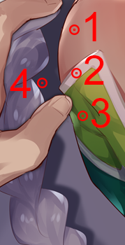
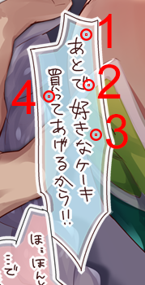
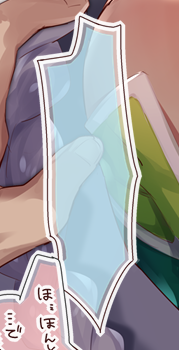

# Color Bruteforcer
## Find an unknown overlay color


[](https://travis-ci.org/torsten-ostgard/color-bruteforcer)
[](https://ci.appveyor.com/project/torsten-ostgard/color-bruteforcer)
[](https://codecov.io/gh/torsten-ostgard/color-bruteforcer)
[](https://deps.rs/repo/github/torsten-ostgard/color-bruteforcer)


## Introduction
`color_bruteforcer` is a program that given a set of base colors C<sub>B</sub> and target colors C<sub>T</sub>, attempts to find the unknown overlay color C<sub>O</sub> at opacity &alpha; that, when overlayed on all elements of C<sub>B</sub>, produces the corresponding colors of C<sub>T</sub>. This is done by performing a bruteforce search on the entire RGB color space and alpha values from 1% to 99% opacity.


## Example
| Base | Target | Base with overlay |
| :---: | :---: | :---: |
|  |  |  |

The single pixel acting as the "bullseye" in each of the circles as seen in the above images will be a color sample. Take the six character hex codes of the samples and pass them in to the program:

```
$ ./color_bruteforcer --base-colors=b37d74,cbadb0,546c2c,363247 --target-colors=c1d8e2,c6e2ef,aed4d3,a8c8d9
```

The color bruteforcer should identify `#c5effe` at 80% opacity as the overlay color that will produce the closest match. To create the result image, copy the shape of the text bubble from the base image and apply a Color Overlay layer effect to it using the aforementioned color and opacity. Knowing that the opacity of the guess looks right and seeing that the pink overlay color seems to be of a similar opacity, it is safe to assume that the other overlay color will be in the same opacity range. We can use this knowledge to drastically cut down on the search time by restricting the range of alpha values to only those which are realistic. The color bruteforcer can also accept color inputs from `stdin`, so to find the pink overlay color, run this:

```
$ ./color_bruteforcer --alpha-min=75 --alpha-max=85 < examples/readme_example_pink_colors
```

The closest match is `#fec4c5`, also at 80% opacity. The final result with both the blue and pink overlays can be seen in the full readme example image located in the `examples` directory.


## Usage
```
USAGE:
    color_bruteforcer [OPTIONS]

FLAGS:
    -h, --help       Prints help information
    -V, --version    Prints version information

OPTIONS:
        --alpha-max <alpha_max>            The highest opacity value to check [default: 99]
        --alpha-min <alpha_min>            The lowest opacity value to check [default: 1]
        --base-colors <base_colors>        Comma-separated six character hex codes for the base colors
    -d, --distance <distance>              The maximum distance between two colors that will let a guess be considered a
                                           match
                                           A distance below 1.0 is generally considered to be visually
                                           indistinguishable, while 2.1 is generally considered to be a barely
                                           noticeable difference [default: 1.0]
    -r, --results <results>                The maximum number of results to display
                                           Supply zero or a negative value to see all results. [default: 25]
        --target-colors <target_colors>    Comma-separated six character hex codes for the target colors
```
